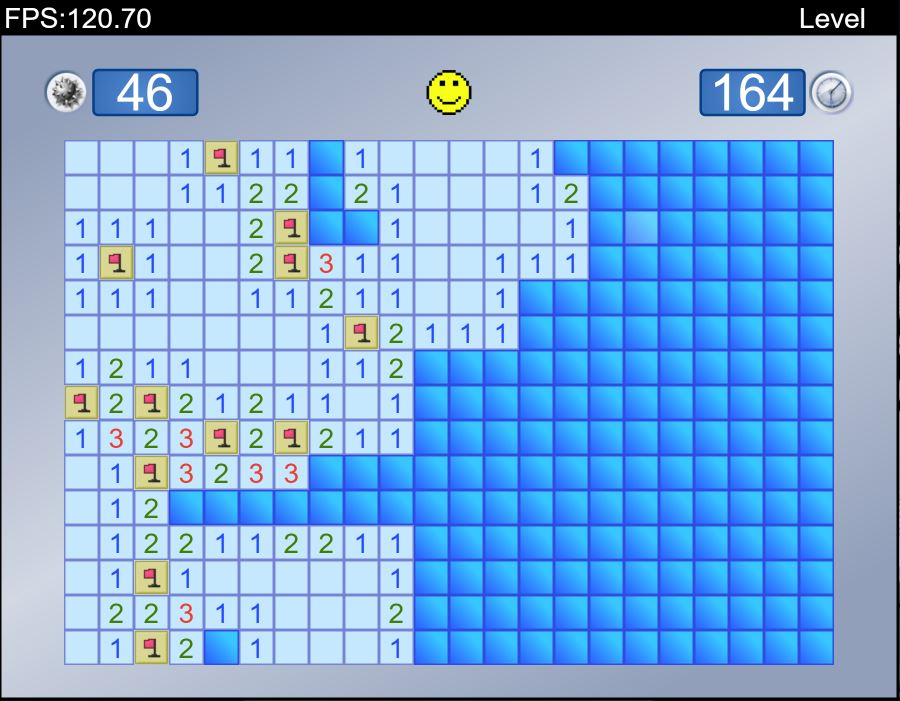

# MINESWEEPER

## 1. Introduction

Minesweeper is a one player game created by Curt Johnson y Robert Donner in 1989. The objective of the game is to clear a board containing hidden mines. The game when you discover all de mines without detonating any of them. To accomplish this objective, the board gives clues about how many bombs there are around.

## 2. Motivation
Minesweeper is a game that is fast to play, where you have to think, deduct, and guess. I've been playing it since my childhood on all Windows versions  and it's currently the only game I got install in mobile phone.

## 3. Installation

## 4. Instructions

## 5. Packages and dependencies
- **Typescript:** Suport for typescript
- **Lodash:** JS utility library 
- **Parcel:** Fast and easy server build
- **Eslint:** Code Styling